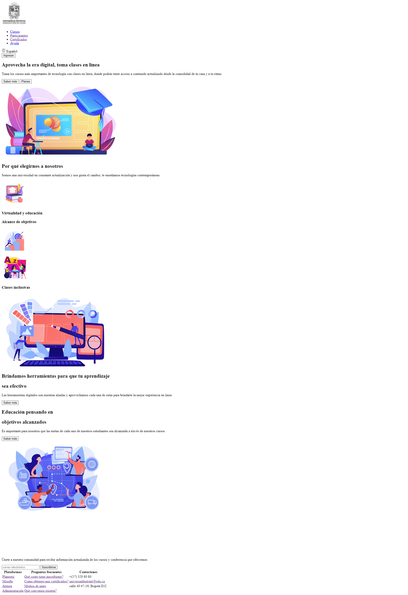

<h1>Taller 9 Laura Tatiana Rodríguez González </h1>

<h2> Información</h2>

Curso: full Stack Basico - Grupo 1

Profesor: Cristian Patiño

<h2> Punto 1: Link figma</h2>

<a href="https://www.figma.com/file/frzmRrUYa96wkwilYpGf2d/Taller-9?type=design&node-id=2%3A259&mode=design&t=fyIaLJsRHoU7HooN-1" target="_blank">Link de Figma</a>

<h2> Punto 2: HTML</h2>
